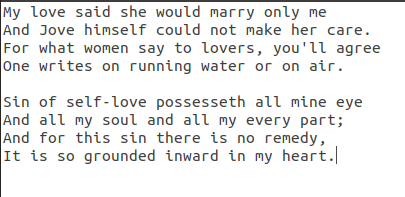

# Text-Recognition Using OpenCV and Tesseract OCR

Computer don't have the ability to process the videos and images on their own like humans. We can interpret any kind of images to a large extent but the machines lack this ability.

Computer Vision gives them this ability to interpret digital images and videos. Computer Vision is about teaching the computer to see and interpret and process these images for better understanding. Computer Vision is about how computer can gain high level of understanding from digital images.

Field of Use:
<ul>
  <li>Self Driving Cars</li>
  <li>Facial Recognition</li>
  <li>Malicious object detection for security purpose</li>
</ul>  

OpenCV is an open source computer vision library for image processing, Machine Learning. It is a cross platform library.Some of its use cases are:
<ul>
  <li>It includes interfaces for C, C++, Java, and Python</li>
  <li>It is used to process static images</li>
  <li>It is also used to process offline videos and/or streaming videos</li>
</ul>

Tesseract OCR is an optical character recognition engine, which has the ability to recognize words and text files.

In this project I have used <code>OpenCV</code> and <code>Tesseract OCR</code> to process a text image to detect the words in the image. 
The project work includes 
<li>Importing an Image from the local computer, or </li> 
<li>Downloading an Image over the Internet using <code>urllib.request</code> module</li>

When the image is loaded it is read using <code>imread()</code> function from the <code>cv2</code> module.
The image  read by the imread function is by default in <code>BGR</code> format and needs to be converted to <code>Gray</code> scale image before processing for better text recognition.
After the image is converted into the desired scale of colors it is resized and then using the <code>Gaussian Blur</code> technique it is formatted.
After formatting of the image, the image is then passed through the <code>Tesseract OCR</code> to return a string which is then processed to return the final text contained in the image.

## Visual Represenation 
  
<code><b><i>I NEVER DREAMED ABOUT SUCCESS. I WORKED FOR IT</i><b></code>
  

 
<code>
<b><i>
My love said she would marry only me  
And Jove himself could not make her care. 
For what women say to lovers, you'll agree 
lone writes on running water or on air.  

Sin of self-love possesseth all mine eye 
And all my soul and all my every part;  
land for this sin there is no remedy,  
It is so grounded inward in my heart.
</i><b>
</code>
 